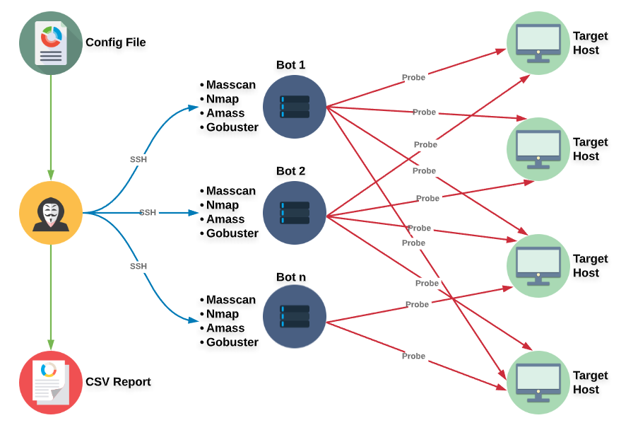
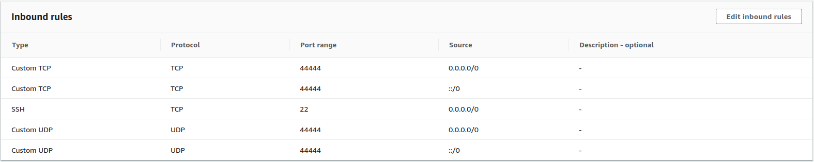
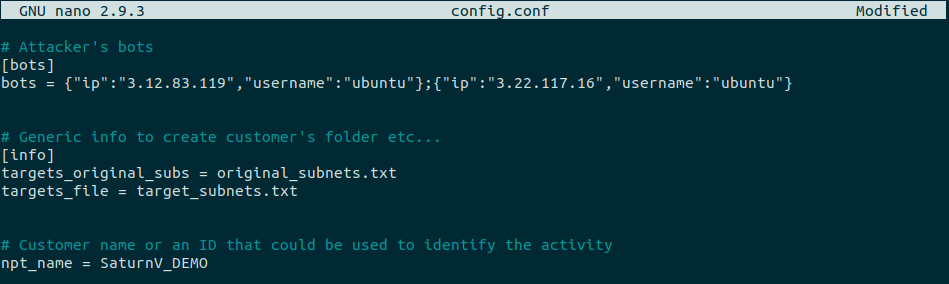
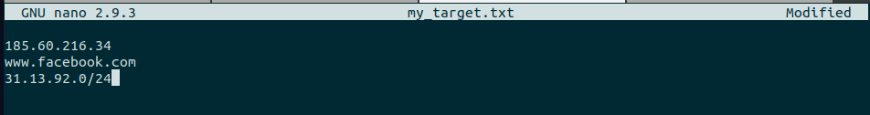
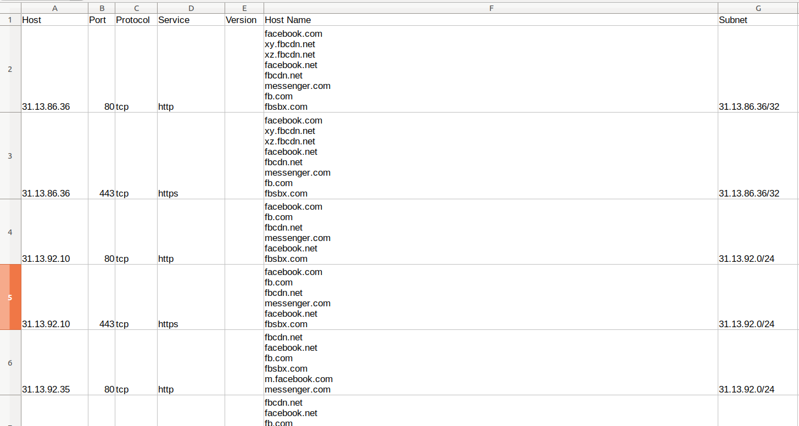

#  SaturnV
#### Boost your Network Discovery & Recon activity.

SaturnV provides a fast deployable distributed port scanner and information collector infrastructure. This software was developed to provide a lightweight tool to pentesters who need to perform sporadic Network PenTest activities on big ranges of public faced IP subnets. The idea behind this tool is simple: I need that my PC uses remote bots to perform port scans and discovery activities in a distributed way. Once bots have finished the scans I just need to grab the results on my local machine, parse them and output a "starting report" that could be useful for further manual analysis.

### Main Features
- Different scanning approach: since we have to optimize time, masscan is used to perform a SYN scan on all ports of every hosts. The results provided by masscan will be used as input for nmap and other tools that will provide more information about services (like banners or versions).
- Asynchronous operations: bots are autonomous and work without staying connected to any sort of master host. So I can use this software on my PC to start the scan on the bots and then I can turn it off, no data will be lost.
- Customizable: through the configuration file it is possible to tune your scan parameter and the tools command line. 



## Dependencies and Installation
### Local (Attacker) Machine Setup
Python3 and python3-pip is required to run SaturnV and its dependencies. Setup is very simple using pip.
```bash
git clone https://github.com/c0mix/SaturnV.git 
cd SaturnV
pip install -r requirements.txt
```

### Bots Configuration
#### Host Requirements
- Minimum 1GB RAM
- OS: Ubuntu 18.04.4 LTS (This is not mandatory but I've tested the tool on it)

#### Firewall and Security
If you are using Amazon AWS ec2 instances as bots (or any other provider witch uses built-in firewall configuration), please remember to setup accordingly your security policy, in particular masscan needs the port 44444 open. Below is provided an example of AWS security rule configuration.



#### User Permissions
In order to boost performance while avoiding permissions errors, bot's user must be in condition to execute sudo commands without asking for password. Add the following line at the end of `/etc/sudoers` file.
```bash
user-name ALL=(ALL) NOPASSWD: ALL
``` 

## Usage Instructions
### Configuration 
Declare the IP and the username of all your bots inside the configuration file `config.conf` under the section `bots`.
```bash
[bots]
bots = {"ip":"213.171.185.113","username":"ecuser"};{"ip":"212.35.216.92","username":"ecuser"}
```

### SSH key
Create and deploy a ssh key launching the program only with the `--ssh_key` option (`-k`). You can also put an existing key in the `ssh_key` folder and this will be used instead a new one. **PLEASE NOTE that this key will be pushed on all your bots so be careful.** 
```bash
python3 saturnV.py --ssh-key 
```
NOTE: if you want to use Amazon's AWS EC2 instances as bots you can copy the private ssh key that you have deployed on your instances inside `ssh_key` folder of SaturnV.

### Setup the bots
In order to equip all your bots with the necessary tools you have to launch the program with the `--setup` option only (`-s`). Please remember to check what is your bot network interface name (e.g. eth0) and change the following command inside `bot_dependencies.txt` file at line 21.
```bash
sudo iptables -A INPUT -i eth0 -p tcp --dport 44444 -j DROP
```
If you want you can also edit the dependency list contained in `bot_dependencies.txt` file. **Each line of this file is a bash command that will be executed on all your bots.** By default there are listed the minimum setup commands needed to perform the NPT analysis so you should not delete any command already present in the file. 
```bash
python3 saturnV.py --setup 
```

### Targets
SaturnV can help you in define a correct target list. It is possible to start the software with the `-t` or `--target` option and provide a heterogeneous list of target such as the following `all_targets.txt` file:
```text
185.60.216.34
www.facebook.com
31.13.92.0/24
``` 
SaturnV will parse your list, convert domain names into IP addresses and put all targets in CIDR notation inside the default files `original_subnets.txt` and `target_subnets.txt`. 
```bash
python3 saturnV.py --target all_targets.txt
cat target_subnets.txt 
185.60.216.34/32
31.13.86.36/32
31.13.92.0/24
```
You are now ready to start the analysis **BUT** if you want better performance, greater masscan reliability and an equal bots workload you should split your target nets into equal subnets. In order to to this operation you can use the [subnet_splitter](https://github.com/c0mix/subnet_splitter) script as shown below:
```bash
wget https://raw.githubusercontent.com/c0mix/subnet_splitter/master/subnet_splitter.py 
python3 subnet_splitter.py --input original_subnets.txt --output target_subnets.txt --size 26
cat target_subnets.txt 
185.60.216.34/32
31.13.86.36/32
31.13.92.0/26
31.13.92.64/26
31.13.92.128/26
31.13.92.192/26
```
You should notice that the application will specify the original subnets related to an host inside the final report.

### Masscan
In order to create and the start a masscan port scan you have to:
1. Review the masscan `masscan_cmd` and `masscan_cmd_udp` command lines in the `config.conf` file, adjusting with your preferred settings the rate and the wait time. Please do not touch the output format and the other {} options. 
2. Launch the tool with the `--masscan-script` option or with `-mS`. This operation will produce, based on your targets, the file `scripts/masscan_scan_script.sh`.
3. Launch the tool with the `--masscan-run` option or with `-mR`. This operation will split the aforementioned file on your bots and then start the attacks.
```bash
python3 saturnV.py --masscan-script
python3 saturnV.py --masscan-run
```

### Check scan status 
Launching the program with the `--check-scan` option (`-c`) it is possible to verify if the tools activity is `started`, `finished` or not started at all. This step it is strongly suggested before grabbing the results from the bots.
```bash
python3 saturnV.py --check-scan
```

### Grab results
After masscan execution you have to grab the results from your bots (`-g` or `--get-results`). These results will be parsed and used as input for others analysis such as nmap and amass.
```bash
python3 saturnV.py --get-results
```

### Nmap and Amass
Based on the results provided by Masscan it is possible to execute in-deep analysis on hosts and open ports. The Nmap tool is used to grab banners (`-nS` or `--nmap-script` option) while Amass (`-aS` or `--amass-script` option) provides useful information regarding hostnames. This analysis are not mandatory but are strongly recommended.
```bash
python3 saturnV.py -nS
python3 saturnV.py -aS
python3 saturnV.py --amass-run --nmap-run
```

### Gobuster
Based on the results provided by Masscan it is possible to execute in-deep analysis on web services, in particular the gobuster tool is used to discover juicy directory or files (`-gS` or `--gobuster-script` option). This analysis are not mandatory but are strongly recommended. Please note that StaurnV, in order to detect if a web service is listening on a specific port will probe an http and https request against each open ports. Every web service that responds at this first probe will be added as target for gobuster. 
```bash
python3 saturnV.py --gobuster-script
python3 saturnV.py --gobuster-run
```  

### Report & OSINT 
when you are satisfied by all the information gathered you are ready to put everything together in a simple and readable CSV file providing the `--report` or `-r` switch to the application. **Just remember to grab all data from your bots before creating a report!**
SaturnV can execute some OSINT passive research on discovered hosts. These analysis take advantage of the following resources:
1. the Bing search engine with the `IP:` dork in order to find juicy file and information hosted on web servers. The results of this analysis will be placed in one single file `outputs/bing/url_resources.txt`.
2. the Hackertarget API in order to discover as much host names as possible (Limited by request rate).
3. the SSL certificate analysis in order to find out vhosts.
  
If you want to perform these operations, you have to provide the `-o` or `--osint` option while requesting the final report.
```bash
python3 saturnV -g --report --osint # Grab results and produce a report with OSINT info
python3 saturnV -g --report # Grab results and produce a report without OSINT info 
```

## Execution Example
1. Clone the project from github
  ```
  ubuntu@ip-172-31-6-246:~$ git clone https://github.com/c0mix/SaturnV.git
  Cloning into 'SaturnV'...
  remote: Enumerating objects: 32, done.
  remote: Counting objects: 100% (32/32), done.
  remote: Compressing objects: 100% (25/25), done.
  remote: Total 32 (delta 10), reused 25 (delta 4), pack-reused 0
  Unpacking objects: 100% (32/32), done.
  ```
2. Install the requirement on attacker's PC
  ```
  ubuntu@ip-172-31-6-246:~$ cd SaturnV/
  ubuntu@ip-172-31-6-246:~/SaturnV$ sudo pip3 install -r requirements.txt 
  Collecting aiocontextvars==0.2.2 (from -r requirements.txt (line 1))
    Downloading https://files.pythonhosted.org/packages/db/c1/7a723e8d988de0a2e623927396e54b6831b68cb80dce468c945b849a9385/aiocontextvars-0.2.2-py2.py3-none-any.whl
  Collecting bcrypt==3.1.7 (from -r requirements.txt (line 2))
    Downloading https://files.pythonhosted.org/packages/8b/1d/82826443777dd4a624e38a08957b975e75df859b381ae302cfd7a30783ed/bcrypt-3.1.7-cp34-abi3-manylinux1_x86_64.whl (56kB)
  100% |████████████████████████████████| 61kB 3.0MB/s 
  [ . . . ]
  Successfully installed PyNaCl-1.3.0 aiocontextvars-0.2.2 bcrypt-3.1.7 certifi-2020.4.5.1 cffi-1.14.0 contextvars-2.4 cryptography-2.8 idna-2.9 immutables-0.11 loguru-0.4.1 paramiko-2.7.1 pyOpenSSL-19.1.0 pycparser-2.19 python-libnmap-0.7.0 pyxattr-0.7.1 requests-2.23.0 scp-0.13.2 six-1.14.0 urllib3-1.25.9
  ubuntu@ip-172-31-6-246:~/SaturnV$ python3 saturnV.py 

  ***** Welcome to SaturnV *****

  14:37:03 | ERROR | No argument provided!

  usage: saturnV.py [-h] [-t TARGET] [-k] [-s] [-mS] [-nS] [-aS] [-gS] [-mR]
    [-nR] [-aR] [-gR] [-g] [-c] [-o] [-r] [-v]

  Boost your Network Discovery & Recon activity.

  optional arguments:
    -h, --helpshow this help message and exit
    -t TARGET, --target TARGET
  Takes as input a multi format target list and produces
  the original_subnets.txt file
    -k, --ssh-key Deploy an ssh key on bots
    -s, --setupInstall all the required tools and create folder
  structure on bots
    -mS, --masscan-script
  Create the Masscan script
    -nS, --nmap-scriptCreate the Nmap script (Masscan results needed!)
    -aS, --amass-scriptCreate the Amass script (Masscan results needed!)
    -gS, --gobuster-script
  Create the Gobuster script (Masscan results needed!)
    -mR, --masscan-runSplit and run Masscan script on bots
    -nR, --nmap-runSplit and run Nmap script on bots
    -aR, --amass-run  Split and run Amass script on bots
    -gR, --gobuster-runSplit and run Gobuster script on bots
    -g, --get-results Collect outputs from all bots
    -c, --check-scan  Check scan progress on each bot
    -o, --osintPerform OSINT activity (Grab info from SSL certs,
  HackerTarget and Bing Dork)
    -r, --report  Create the final report (at least Masscan results
  needed!)
    -v, --verbose Increase output verbosity
  ```

3. Edit the configuration file with your parameters (at least `bots` and `npt_name` must be set)



4. Setup youre SSH Key (in this case I'm using AWS bots so I've putted my private key inside ssh_key folder)
  ``` 
  ubuntu@ip-172-31-6-246:~/SaturnV$ ls -l ssh_key/
  total 4
  -r-------- 1 ubuntu ubuntu 1692 May  9 14:27 lcomi.pem
  ```

5. Setup bots
  ```
  ubuntu@ip-172-31-6-246:~/SaturnV$ python3 saturnV.py --setup

  ***** Welcome to SaturnV *****

  14:46:42 | INFO | SSH private key found in ssh_key folder, the following key will be used: lcomi.pem
  14:46:44 | INFO | Command: mkdir ~/saturnV Executed on Bot: 3.12.83.119
  14:46:44 | INFO | Command: touch /tmp/saturnV_install_log.txt Executed on Bot: 3.12.83.119
  14:46:44 | INFO | Uploaded bot_dependencies.txt to ~/saturnV/bot_dependencies.sh
  14:46:44 | INFO | Command: chmod +x ~/saturnV/bot_dependencies.sh Executed on Bot: 3.12.83.119
  14:46:44 | INFO | Starting dependencies installation on Bot 3.12.83.119, this might take a while...
  14:46:56 | INFO | Dependencies installation on Bot 3.12.83.119 is FINISHED, please review logs/saturnV_install_log_3_12_83_119.txt log file to check if everything went well!
  14:46:58 | INFO | Command: mkdir ~/saturnV Executed on Bot: 3.22.117.16
  14:46:58 | INFO | Command: touch /tmp/saturnV_install_log.txt Executed on Bot: 3.22.117.16
  14:46:58 | INFO | Uploaded bot_dependencies.txt to ~/saturnV/bot_dependencies.sh
  14:46:58 | INFO | Command: chmod +x ~/saturnV/bot_dependencies.sh Executed on Bot: 3.22.117.16
  14:46:58 | INFO | Starting dependencies installation on Bot 3.22.117.16, this might take a while...
  14:47:11 | INFO | Dependencies installation on Bot 3.22.117.16 is FINISHED, please review logs/saturnV_install_log_3_22_117_16.txt log file to check if everything went well!
```

6. Define your target inside a file, such as the following `my_target.txt`
  
  ```
  ubuntu@ip-172-31-6-246:~/SaturnV$ python3 saturnV.py --target my_target.txt 

  ***** Welcome to SaturnV *****

  15:05:04 | INFO | File my_target.txt was successfully elaborated, new targets file is original_subnets.txt
  ubuntu@ip-172-31-6-246:~/SaturnV$ wget https://raw.githubusercontent.com/c0mix/subnet_splitter/master/subnet_splitter.py && python3 subnet_splitter.py --input original_subnets.txt --output target_subnets.txt --size 28
  --2020-05-09 15:07:13--  https://raw.githubusercontent.com/c0mix/subnet_splitter/master/subnet_splitter.py
  Resolving raw.githubusercontent.com (raw.githubusercontent.com)... 151.101.124.133
  Connecting to raw.githubusercontent.com (raw.githubusercontent.com)|151.101.124.133|:443... connected.
  HTTP request sent, awaiting response... 200 OK
  Length: 2499 (2.4K) [text/plain]
  Saving to: ‘subnet_splitter.py’

  subnet_splitter.py 100%[=====================================>]2.44K  --.-KB/sin 0s  

  2020-05-09 15:07:13 (46.8 MB/s) - ‘subnet_splitter.py’ saved [2499/2499]

  ubuntu@ip-172-31-6-246:~/SaturnV$ cat target_subnets.txt
  185.60.216.34/32
  31.13.71.36/32
  31.13.92.0/28
  31.13.92.16/28
  31.13.92.32/28
  31.13.92.48/28
  31.13.92.64/28
  31.13.92.80/28
  31.13.92.96/28
  31.13.92.112/28
  31.13.92.128/28
  31.13.92.144/28
  31.13.92.160/28
  31.13.92.176/28
  31.13.92.192/28
  31.13.92.208/28
  31.13.92.224/28
  31.13.92.240/28
  ```

7. Prepare and launch masscan test 
  ```
  ubuntu@ip-172-31-6-246:~/SaturnV$ python3 saturnV.py --masscan-script --masscan-run

  ***** Welcome to SaturnV *****

  15:08:52 | INFO | SSH private key found in ssh_key folder, the following key will be used: lcomi.pem
  15:08:52 | INFO | Successfully parsed and added 18 targets subnets
  15:08:54 | INFO | Uploaded scripts/masscan_scan_script_1.sh to ~/saturnV/scripts/
  15:08:54 | INFO | Command: chmod +x ~/saturnV/scripts/masscan_scan_script_1.sh Executed on Bot: 3.12.83.119
  15:08:54 | INFO | Command: cd ~/saturnV/ && tmux new -d -s masscan "scripts/masscan_scan_script_1.sh" Executed on Bot: 3.12.83.119
  15:08:55 | INFO | Uploaded scripts/masscan_scan_script_2.sh to ~/saturnV/scripts/
  15:08:55 | INFO | Command: chmod +x ~/saturnV/scripts/masscan_scan_script_2.sh Executed on Bot: 3.22.117.16
  15:08:55 | INFO | Command: cd ~/saturnV/ && tmux new -d -s masscan "scripts/masscan_scan_script_2.sh" Executed on Bot: 3.22.117.16
  ubuntu@ip-172-31-6-246:~/SaturnV$ python3 saturnV.py --check

  ***** Welcome to SaturnV *****

  15:09:02 | INFO | SSH private key found in ssh_key folder, the following key will be used: lcomi.pem
  15:09:03 | WARNING | masscan execution STARTED on Bot: 3.12.83.119
  15:09:04 | WARNING | masscan execution STARTED on Bot: 3.22.117.16
  ```

8. Wait until the scan is finished on all your bots, the grab the results.
  ```
  $ python3 saturnV.py --check

  ***** Welcome to SaturnV *****

  16:51:03 | INFO | SSH private key found in ssh_key folder, the following key will be used: lcomi.pem
  16:51:04 | INFO | masscan execution 100% completed on Bot: 3.12.83.119
  16:51:05 | INFO | masscan execution 100% completed on Bot: 3.22.117.16
  ubuntu@ip-172-31-6-246:~/SaturnV$ python3 saturnV.py --get-results

  ***** Welcome to SaturnV *****

  17:01:20 | INFO | SSH private key found in ssh_key folder, the following key will be used: lcomi.pem
  17:01:21 | INFO | Transferring outputs/masscan from bot 3.12.83.119 to local outputs/ folder
  17:02:05 | INFO | Transferring outputs/masscan from bot 3.22.117.16 to local outputs/ folder
  ```

9. Prepare and lauch other scans
  ```
  ubuntu@ip-172-31-6-246:~/SaturnV$ python3 saturnV.py --nmap-script --amass-script --gobuster-script --nmap-run --amass-run --gobuster-run

  ***** Welcome to SaturnV *****

  17:03:27 | INFO | SSH private key found in ssh_key folder, the following key will be used: lcomi.pem
  17:03:27 | INFO | Parsing Masscan scan results
  17:03:27 | INFO | Masscan discovery has found 103 open services on 52 different hosts
  17:03:27 | INFO | Nmap script created: scripts/nmap_scan_script.sh
  17:03:27 | INFO | Amass script created: scripts/amass_scan_script.sh
  17:03:27 | INFO | Checking web service presence on each open service, this might take a while...
  17:04:11 | INFO | Gobuster script created: scripts/gobuster_scan_script.sh
  17:04:12 | INFO | Uploaded scripts/nmap_scan_script_1.sh to ~/saturnV/scripts/
  17:04:12 | INFO | Command: chmod +x ~/saturnV/scripts/nmap_scan_script_1.sh Executed on Bot: 3.12.83.119
  17:04:12 | INFO | Command: cd ~/saturnV/ && tmux new -d -s nmap "scripts/nmap_scan_script_1.sh" Executed on Bot: 3.12.83.119
  17:04:14 | INFO | Uploaded scripts/nmap_scan_script_2.sh to ~/saturnV/scripts/
  17:04:14 | INFO | Command: chmod +x ~/saturnV/scripts/nmap_scan_script_2.sh Executed on Bot: 3.22.117.16
  17:04:14 | INFO | Command: cd ~/saturnV/ && tmux new -d -s nmap "scripts/nmap_scan_script_2.sh" Executed on Bot: 3.22.117.16
  17:04:14 | INFO | Uploaded scripts/amass_scan_script_1.sh to ~/saturnV/scripts/
  17:04:14 | INFO | Command: chmod +x ~/saturnV/scripts/amass_scan_script_1.sh Executed on Bot: 3.12.83.119
  17:04:14 | INFO | Command: cd ~/saturnV/ && tmux new -d -s amass "scripts/amass_scan_script_1.sh" Executed on Bot: 3.12.83.119
  17:04:14 | INFO | Uploaded scripts/amass_scan_script_2.sh to ~/saturnV/scripts/
  17:04:14 | INFO | Command: chmod +x ~/saturnV/scripts/amass_scan_script_2.sh Executed on Bot: 3.22.117.16
  17:04:15 | INFO | Command: cd ~/saturnV/ && tmux new -d -s amass "scripts/amass_scan_script_2.sh" Executed on Bot: 3.22.117.16
  17:04:15 | INFO | Uploaded scripts/gobuster_scan_script_1.sh to ~/saturnV/scripts/
  17:04:15 | INFO | Command: chmod +x ~/saturnV/scripts/gobuster_scan_script_1.sh Executed on Bot: 3.12.83.119
  17:04:15 | INFO | Command: cd ~/saturnV/ && tmux new -d -s gobuster "scripts/gobuster_scan_script_1.sh" Executed on Bot: 3.12.83.119
  17:04:15 | INFO | Uploaded scripts/gobuster_scan_script_2.sh to ~/saturnV/scripts/
  17:04:15 | INFO | Command: chmod +x ~/saturnV/scripts/gobuster_scan_script_2.sh Executed on Bot: 3.22.117.16
  17:04:15 | INFO | Command: cd ~/saturnV/ && tmux new -d -s gobuster "scripts/gobuster_scan_script_2.sh" Executed on Bot: 3.22.117.16
  ```

10. Grab again the results, make OSINT and finally produce the CSV report.
  ```
  ubuntu@ip-172-31-6-246:~/SaturnV$ python3 saturnV.py --get-results --osint --report

  ***** Welcome to SaturnV *****

  17:08:51 | INFO | SSH private key found in ssh_key folder, the following key will be used: lcomi.pem
  17:08:52 | INFO | Transferring outputs/masscan from bot 3.12.83.119 to local outputs/ folder
  17:09:01 | INFO | Transferring outputs/amass from bot 3.12.83.119 to local outputs/ folder
  17:09:11 | INFO | Transferring outputs/nmap from bot 3.12.83.119 to local outputs/ folder
  17:09:36 | INFO | Transferring outputs/gobuster from bot 3.12.83.119 to local outputs/ folder
  17:09:42 | INFO | Transferring outputs/masscan from bot 3.22.117.16 to local outputs/ folder
  17:09:50 | INFO | Transferring outputs/amass from bot 3.22.117.16 to local outputs/ folder
  17:10:00 | INFO | Transferring outputs/nmap from bot 3.22.117.16 to local outputs/ folder
  17:10:25 | INFO | Transferring outputs/gobuster from bot 3.22.117.16 to local outputs/ folder
  17:10:29 | INFO | Parsing Masscan scan results
  17:10:29 | INFO | Nmap outputs found! Adding them to final report
  17:10:29 | INFO | Parsing Nmap scan results
  17:10:29 | INFO | Services found by Nmap: 103 - Services found by Masscan: 103
  17:10:29 | INFO | Amass outputs found! Adding them to final report
  17:10:29 | INFO | Parsing Amass scan results
  17:10:29 | INFO | Gobuster outputs found! you can manually review them in outputs/gobuster folder
  17:10:29 | INFO | Getting information through OSINT
  17:11:48 | INFO | Web application URLs eventually discovered with Bing dork can be found here: outputs/bing/url_resources.txt
  17:11:48 | INFO | Creating the final report: final_output.csv
  ```
  


## References
- Masscan: https://github.com/robertdavidgraham/masscan
- Nmap: https://nmap.org/
- Amass: https://github.com/OWASP/Amass
- Gobuster: https://github.com/OJ/gobuster
- HackerTarget: https://hackertarget.com/

## Why SaturnV
The name of this tool wants to honor the magnificent NASA rocket which carried men on the moon in 1969.

> As of 2020, the Saturn V remains the tallest, heaviest, and most powerful rocket ever brought to operational status.


## Legals
The software is provided "as is", without warranty of any kind, express or implied, including but not limited to the warranties of merchantability, fitness for a particular purpose and non infringement. In no event shall the authors or copyright holders be liable for any claim, damages or other liability, whether in an action of contract, tort or otherwise, arising from,out of or in connection with the software or the use or other dealings in the software.

Happy (Ethical) Hacking.
